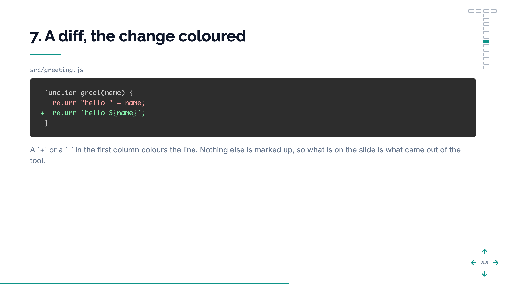
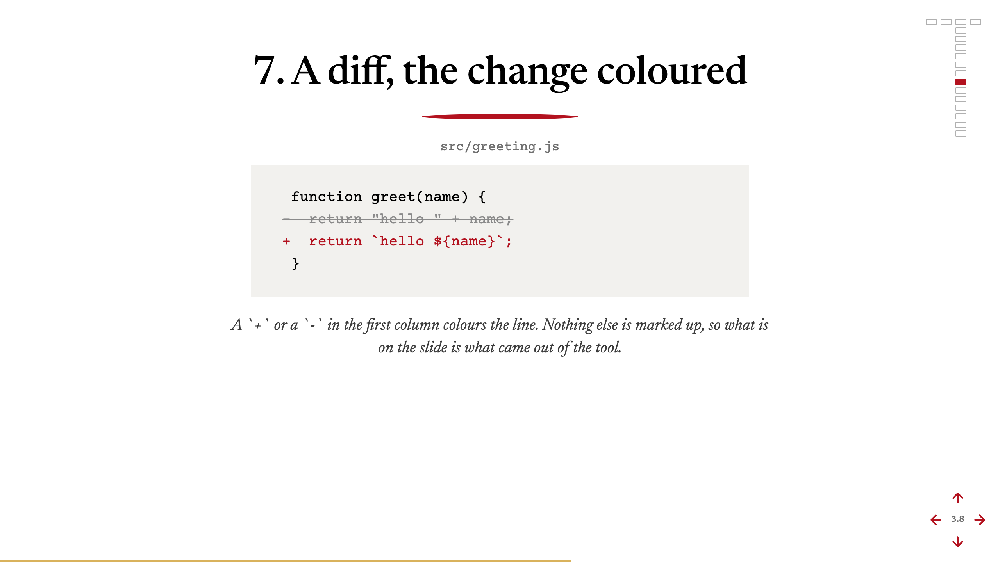

# sipario

A conference talk as one markdown file, rendered in the browser.

You write `deck.md`. A `# ` line opens a movement, a `## 3.2 A title` line
opens a slide, `--` starts the next step of a build, and a fenced
` ```notes ` block is what you say over it. A server renders the file on
every request and reloads the page when you save, so there is no build
and nothing on screen can be a stale copy of something since edited.

It ships **no templates and no design.** What a slide of a given template
looks like is your talk's decision, and your talk carries its own
`templates/` folder beside its `deck.md`. A folder without one is refused
by name rather than quietly handed somebody else's look.

The name is Italian for the theatre curtain.


## Starting a talk

```bash
mkdir my-talk && cd my-talk
npm init -y
npm install sipario
npx sipario new         # a talk in ./talk, named from the folder
npx sipario serve       # http://localhost:9999
```

To run what is on `main` ahead of a release, install from the repo
instead: `npm install github:pardel/sipario`. npm treats it like a
published package, a real folder in `node_modules` with the commit pinned
in your lockfile, and `github:pardel/sipario#v0.1.1` pins a release.

`sipario new` copies `starters/minimal`, the shortest complete talk: one
slide of every template it defines, and the fixture this repo's own suite
renders, so the folder you start from cannot break without the suite
saying so. It refuses a folder that already holds something rather than
writing over it.

`starters/stylish` is the same deck in a different dress, set like the
bill outside an Italian theatre, and shows that a look lives entirely in
a talk's `deck.css` and `templates/`. Copy it instead if you want to
start from that one.

The same slide in each, a diff with the change coloured:




Both commands default their folder to `./talk`, so the pair above needs
nothing typed between them; give either one a folder and it uses that
instead.

The one thing `new` does beyond copying is rewrite the deck's `name:`
from the folder it wrote. That name is the deck's identity — see the format
below — and every talk started from one fixture would otherwise answer to
the same one.

| Command | Does |
|---|---|
| `sipario new [dir]` | start a talk in `[dir]`, or in `./talk` |
| `sipario serve [dir]` | render the folder holding `deck.md`, or `./talk`, reloading on save |
| `sipario renumber <deck.md>` | rewrite slide numbers and id prefixes from position |

`sipario-serve` and `sipario-renumber` are the same two commands under
their own names, for the talks that already have them in their npm
scripts.

A talk is a folder, and every folder in it is mounted at the URL of its
own name:

```
talk/
  deck.md
  deck.css        its typefaces, its colours, and the vocabulary its templates share
  fonts/          the .woff2 files and their licences, vendored
  images/         the figures and the icons, named from the deck without a
                  path; `icon-` marks the small ones a row puts beside a line
  templates/      one .html per template, plus a .js where values have to be
                  worked out and a .css for the rules only that template needs
```

`deck.css` loads after the frame, and each template's sheet after that, so
a rule is overridden by the file that is more specific about where it
applies. What two templates share — headings, standfirsts, captions, code
blocks — stays in `deck.css`; what one template alone puts on a slide sits
beside it.

## The format

````markdown
name: My talk
title: My talk — and what it is about

# Opening

## 1.1 What is actually running
id: 1-what-is-running
template: icon-list

> The standfirst

- (folder) **A heading**
  The line under it.

```notes
The spoken script for this step.
```

--

- (check) **A second row**
  Which arrives at this step.
````

`name` is required, and is the browser tab, the presenter window's title,
the key the deck's bookmarks are saved under, and the name of the channel
the deck and the presenter window talk over. Two decks served from one
origin would otherwise share all four and drive each other.

**A step states what it adds.** Everything the slide has already shown is
still shown, so a line is written once and the build is the order the
lines arrive in. Height is reserved from the slide's last step, so
nothing shifts under itself as a build runs.

Ids and numbers are **declared and then verified, never derived.** The
anchor is a name you chose rather than a slug that moves when you rewrite
a heading, and a number that disagrees with where the slide actually sits
stops the render and names both. `npx sipario renumber talk/deck.md`
rewrites them from position.

Everything that can go wrong stops the render and says what is wrong: a
`>` standfirst on a slide whose template never prints one, a step
restating a line already on the stage, a layer name absent from the SVG,
a template the talk has no file for. A slide that renders plausibly and
wrongly is worse in a room than one that never rendered.

The whole format: [`docs/AUTHORING.md`](docs/AUTHORING.md). Writing a
template: [`docs/TEMPLATES.md`](docs/TEMPLATES.md).

## In the room

| Key | Does |
|---|---|
| <kbd>←</kbd> <kbd>→</kbd> | the previous and next movement |
| <kbd>↓</kbd> <kbd>↑</kbd> | down and up the movement, stepping any build on the way |
| <kbd>O</kbd> | the map: every slide at once, <kbd>Enter</kbd> to go to one |
| <kbd>P</kbd> | the notes, docked beside the deck |
| <kbd>D</kbd> | the notes, in a window of their own, and back |
| <kbd>T</kbd> | the clock: start, pause, then reset |
| <kbd>R</kbd> | forget where each movement was left |
| <kbd>C</kbd> | measure every step against the stage and name what overflows |

The notes are off until asked for, deliberately: a panel that opened by
itself would put your script on whatever screen the deck is being shared
to. Docked and detached are the same page, an iframe on `/presenter`, so
a fix to one cannot miss the other.

## Using it as a library

```js
const { render, talk, serve, talkChecks } = require('sipario');
const fs = require('fs');

const t = talk('./talk');
const { html, deck, slides, steps } = render(fs.readFileSync(t.deck, 'utf8'), t);

serve('./talk', { port: 9999 });
```

`talk()` returns the three paths `render` needs. There is no default:
this library has no talk of its own, and a default would render somebody
else's slides and succeed.

`scaffold(dir)` is what `sipario new` does: the copy, the rename, and the
read-back that proves the rename landed.

`talkChecks(t)` is the list of checks any talk has to pass — its
templates compile, every class one writes has a rule and every rule a
class, every figure it names is on disk, every step has a script — as
`{ name, fn }` pairs for your own suite to run.

## Checking it

```bash
npm test
```

Against a real DOM, because the deck's layout is decided at runtime by
`fit()` and a static render says nothing about it. Two bugs shipped that
way and both are one assertion in there: the slide off-centre when stacks
became grid items, and the slide unscaled when a leftover call to a
deleted function killed the script on its first line.

The loop around that suite, what the 173 checks cover, and what to run
before calling a change done: [`docs/DEVELOPING.md`](docs/DEVELOPING.md).

## What it does not do

No build step, so there is no artefact to go stale. No dependencies: the
server is Node's own `http`, and the format is hand-parsed because a
general markdown parser has to be fought back into these shapes, and the
failure mode of fighting it is a slide that renders plausibly and
wrongly. No PDF export, no themes, no plugin API.

## Releasing

Versions are on npm and tagged here. What has changed in each:
[`CHANGELOG.md`](CHANGELOG.md).

## Contributing

The loop is: start the example, edit, watch the browser reload, run the
suite. There is no build step, so nothing sits between a file and what the
page shows. Setup, a scratch talk and how to clear it away, where every
file lives, and the conventions worth keeping:
[`docs/DEVELOPING.md`](docs/DEVELOPING.md).

## Licence

MIT - please see [`LICENSE`](LICENSE).
